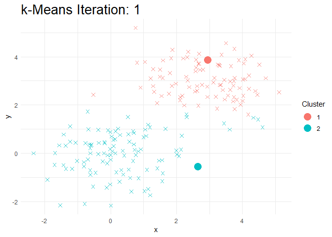

kMeans
================

Outline
-------

In this markdown document we will code a basic *k-Means Clustering* algorithm and use gganimate to create a .gif image to show the progress of the algorithm through each iteration.

Packages
--------

``` r
# Packages ----------------------------------------------------------------
library(tidyr)
library(plyr)
library(dplyr)
library(ggplot2)
library(gganimate)
```

Generating Data
---------------

Our first step is to generate some sample data. We'll use two normal distributions with slightly different means to artificially generate two *clusters* of data.

``` r
# Generate Data -----------------------------------------------------------

# We generate some data using 2 different normal distributions

# data for cluster 1
c1_data <- data.frame("cluster" = "A",
                      "x" = rnorm(100,0,1),
                      "y" = rnorm(100,0,1))

c2_data <- data.frame("cluster" = "B",
                      "x" = rnorm(100,3,1),
                      "y" = rnorm(100,3,1))

# Join clusters together
data <- rbind(c1_data,
              c2_data)
```

We'll plot the data to show the two clusters:

``` r
# Plot
ggplot(data,aes(x = x, y = y, col = cluster)) +
  geom_point() +
  theme_minimal()
```


These are the two clusters that our algorithm will be trying to find.

Prep Data
---------

We need to start by shuffling our data and removing the cluster column we created, it would be cheating if our algorithm could use that!

``` r
# Set Seed
set.seed(0216)

# shuffle data
data <- sample(data)

# remove cluster column in preperation for k-means algorithm
data <- data %>%
  dplyr::select(-cluster)
```

k-Means Algorithm
-----------------

Now we can code our k-Means algorithm. The outline of the k-means clustering algorithm is:

1.  Sample k points from the data as initial mean values for clusters,
2.  calculate the distance from each data point to each of the k means (we are usign Euclidean distance),
3.  for each point use the smallest distance measurement to determine its cluster,
4.  calculate the new cluster means by taking the mean value of each point within the cluster,
5.  repeat for given number of iterations.

``` r
# K-Means Clustering ------------------------------------------------------

kMeansVersionRo <- function(data, k = 2, iterations = 10){
  
  # STEP 1: INITIALIZE LISTS
  
  # initialize means list
  means_list <- vector("list", length = iterations)
  
  # intiialize closest distances list
  closest_distances_list <- vector("list", length = iterations)

  # STEP 2: GET STARTING MEANS
  
  # Get starting means - from random sampled points in the data set
  means <- sample_n(data,
                    k,
                    replace = FALSE)

  
  # STEP 3: START K-MEANS PROCESS
  
  # Begin looping through iterations
  for (i in 1:iterations){
  
    # Put current means into means_list
    means_list[[i]] <- means %>%
      mutate(kmeanid = 1:k,
             Iteration = i)
    
    # Calculate Euclidean distance from each observation to each mean
    distances <- vector("list", length = k)
    
    for (j in 1:k){
      distances[[j]] <- ldply(apply(data,
                                    1,
                                    FUN = function(x){
                                      sqrt(rowSums((x - means[j,])^2))})) %>%
        mutate("kmeanid" = j)
    }
    
    # Pull together into one dataframe
    distances <- ldply(distances) %>%
      mutate(index = ((row_number() - 1) %/% k) + 1,
             index = rep(seq(nrow(data)), k)) %>%
      rename("Distance" = V1)
    
    # add index to data
    data_with_index <- data %>%
      mutate(index = seq(nrow(data)))
    
    # bolt on x and y values using the index
    distances <- merge(distances,
                       data_with_index,
                       by = "index")
    
    # Find min mean
    closest_distances <- distances %>%
      group_by(index) %>%
      filter(Distance == min(Distance)) %>%
      ungroup() %>%
      mutate(Iteration = i)
    
    # Store closest_distances
    closest_distances_list[[i]] <- closest_distances
    
    # Update means
    means <- closest_distances %>%
      dplyr::select(-c(index,Distance, Iteration)) %>%
      group_by(kmeanid) %>%
      summarise_all(.funs = mean) %>%
      ungroup() %>%
      dplyr::select(-kmeanid)
    
    # Print iteration number
    print(paste0("Iteration: ", i))

  }
  
  output <- list("means" = means_list,
                 "data" = closest_distances_list)
  
  
}
```

Now we can use the function to generate our results:

``` r
# Use function:
results <- kMeansVersionRo(data, k = 2, iterations = 5)
```

    ## [1] "Iteration: 1"
    ## [1] "Iteration: 2"
    ## [1] "Iteration: 3"
    ## [1] "Iteration: 4"
    ## [1] "Iteration: 5"

Let's see what it came up with:

``` r
results$means[[5]]
```

    ## # A tibble: 2 x 4
    ##        y       x kmeanid Iteration
    ##    <dbl>   <dbl>   <int>     <int>
    ## 1  2.75   2.96         1         5
    ## 2 -0.157 -0.0274       2         5

Plot Clusters
-------------

Now we'll use ggplot to animate the progress of our algorithm. We need to get our results first:

``` r
# Data
plot_points <- ldply(results$data)

# Means
plot_means <- ldply(results$means)

# Take a look
head(plot_points)
```

    ##   index  Distance kmeanid          y           x Iteration
    ## 1     1 1.3598212       2  0.2332556  1.59871533         1
    ## 2     2 2.3411766       2 -1.0300889  1.48120629         1
    ## 3     3 1.7220237       2  0.1929586  2.02095236         1
    ## 4     4 0.6987375       2  0.9585136 -0.10229219         1
    ## 5     5 0.5461601       2  0.8897000  0.08432531         1
    ## 6     6 2.3654901       2 -1.1057578  1.35159780         1

``` r
head(plot_means)
```

    ##             y         x kmeanid Iteration
    ## 1  4.33750341 3.9871566       1         1
    ## 2  1.12875420 0.5753893       2         1
    ## 3  3.11495833 3.3283438       1         2
    ## 4  0.38558842 0.5385488       2         2
    ## 5  2.89899746 3.0407273       1         3
    ## 6 -0.04700064 0.1593616       2         3

Now we can plot:

``` r
# Plot
p <- ggplot() +
  geom_point(data = plot_points,
             aes(x = x,
                 y = y,
                 col = as.factor(kmeanid)),
             size = 2,
             alpha = 0.8,
             shape = 4) +
  geom_point(data = plot_means,
             aes(x = x,
                 y = y,
                 col = as.factor(kmeanid)),
             size = 5)+
  theme_minimal() +
  guides(col = guide_legend(title = "Cluster")) +
  theme(plot.title = element_text(size = 20))

# Animate plot by iteration
p + transition_manual(Iteration) + labs(title = "k-Means Iteration: {frame}")
```


